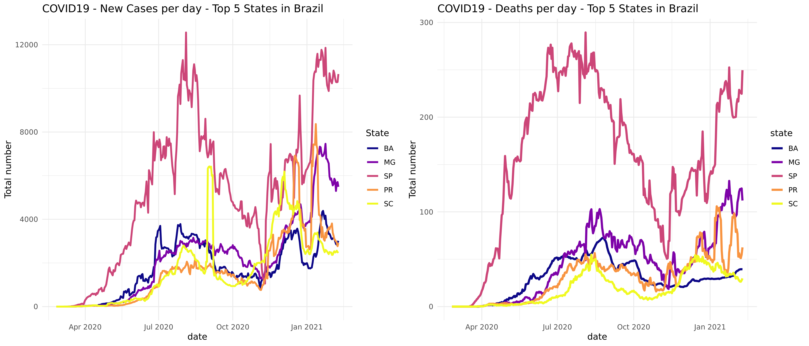
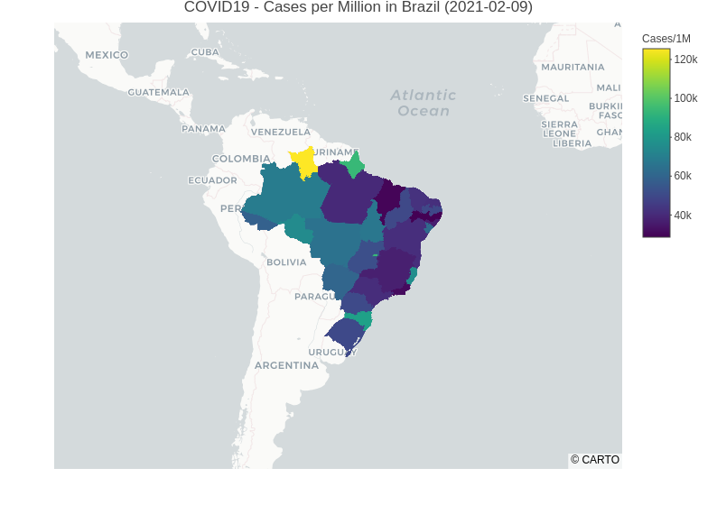

<p align="center">
  
</p>
 
 <div align="center">
  <h2> R tools to get updated information about COVID19 situation in Brazil </h2>
</div>

------

## covidBR - R API
---

Access and manage updated COVID19 data from Brazil with R.

Features:

  - Access data according to specific location (states and cities).
  - Plot the incidence and recorded deaths.
  - Generate interactive maps with Plotly.
  - Use the data to do your personal analyses:
    - State / county IBGE code (id);
    - Estimated poulation in each state / county (population);
    - Cumulative number of cases (sumcases) and deaths (sumdeaths);
    - Number of new cases (newcases) and deaths (newdeaths);
    - 7-days average number of cases (newav) and deaths (deathav).


`covidBR` updates the COVID-19 records from [covid.saude](https://covid.saude.gov.br/), an official website maintained by the Ministry of Health in Brazil.

There is an interactive website in development at my personal website [danieltiezzi](http://danieltiezzi.pro.br)

### Install covidBr

The released version is available on Github

``` r
library(devtools)
install_github("dtiezzi/COVIDBR")
```

### Load the dataset

There is a dedicated function to load a clean and ready to use data.

``` r
covid <- load.covidBr()
ibge <- load.ibgeinfo()
```

### Visualize the data from a specific location based on IBGE code

There are two functions to display the number of new cases and deaths.

``` r
myid <- ibge.id(ibge, 'SP') # get the id from São Paulo State
mychart0 <- view.covid.newcases(covid, myid)
mychart1 <- view.covid.deaths(covid, myid)
```

### You can save your charts as an image

Save your charts in PNG or PDG+F formats.

``` r
png('Covid_new_cases_SP.png', width = 12, height = 8, unit = 'in', res = 300)
mychart0
dev.off()
```

<p align="center">
 
</p>

### You generate interactive maps

Create interactive maps with Plotly on backgound.

``` r
covid <- load.covidBr()
mymap <- view.cases.map(covid, perhab = TRUE)
```
<p align="center">
 
</p>

This is a developing tool to help people to access reliable data from Brazil. We are working with publicly available sequencing data to keep tracking the Sars-Cov-2 mutation profile.

**If you would like to help, please email me: dtiezzi@usp.br**


